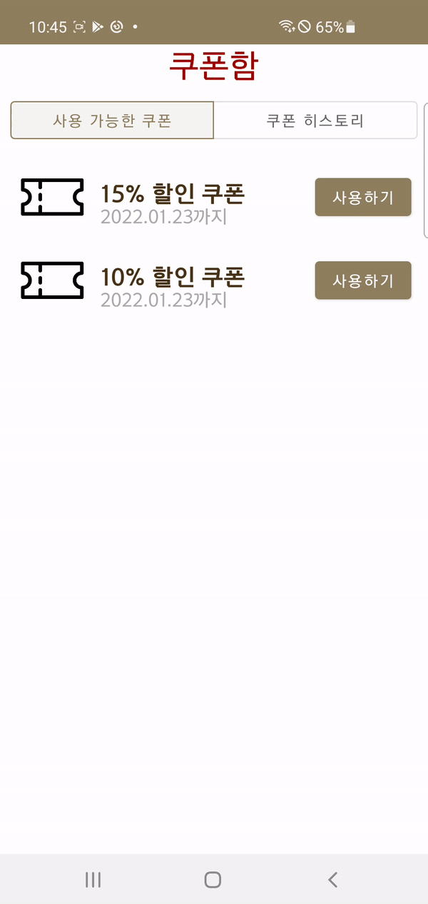

# SSAFYBean App Project

## 개요

- 삼성청년SW아카데미 모바일 트랙의 1학기말 프로젝트
- Offline 상점의 물품을 Online으로 주문할 수 있는 앱을 개선하는 프로젝트
- Android + Spring Boot 사용

## 사용 기술

- Android
  - Language: Kotlin
  - Minimum SDK: API Level 21
  - Devices: NFC, Beacon
  - Frameworks: Retrofit 2, Glide, Google Maps API, AltBeacon, JetPack(Room, LiveData)
- Server
  - Language: Java 8
  - Framework: SpringBoot, Mybatis, Swagger
  - DB: MySQL

## 앱 개선사항

### 회원가입 화면

필수적으로 입력해야 하는 값이 입력되지 않았을 경우 빨간 테두리로 알려주는 기능을 추가하였습니다.

### 평점 선택 화면

별점 선택 기능을 추가하였습니다.

### 선호 메뉴 기능 추가

좋아하는 메뉴를 등록하여 따로 관리할 수 있는 기능을 추가하였습니다.

### 쿠폰 기능 추가

쿠폰 기능을 개발하여 할인된 가격으로 음료를 구입할 수 있습니다.  
사용기한이 끝난 쿠폰은 매일 자정 만료처리 되고, 이 기능은 Spring Scheduler를 사용하여 구현하였습니다.

## 시연영상

[youtube](https://youtu.be/CjunXPBRItw)
